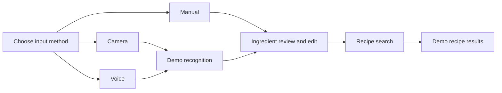
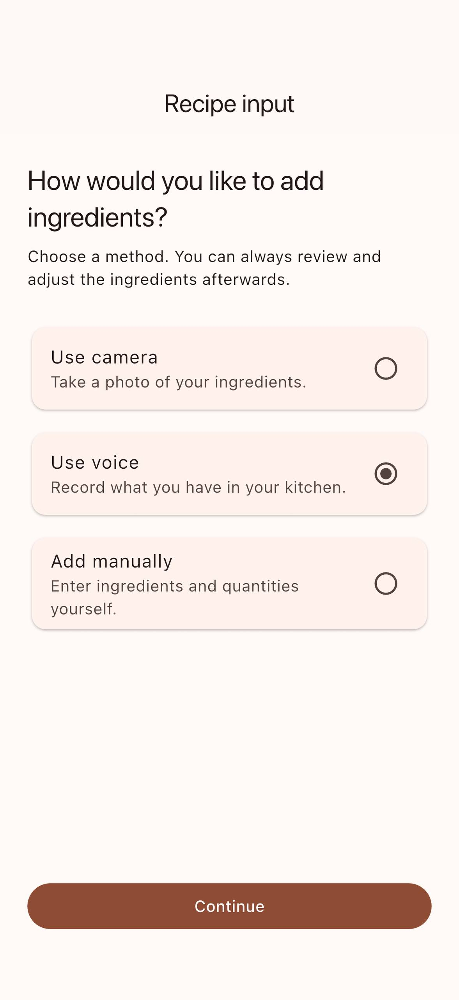
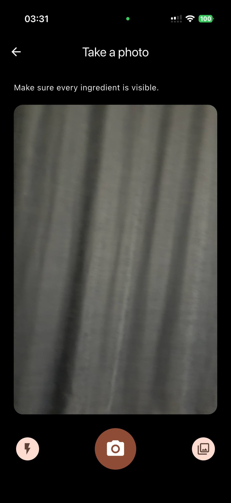
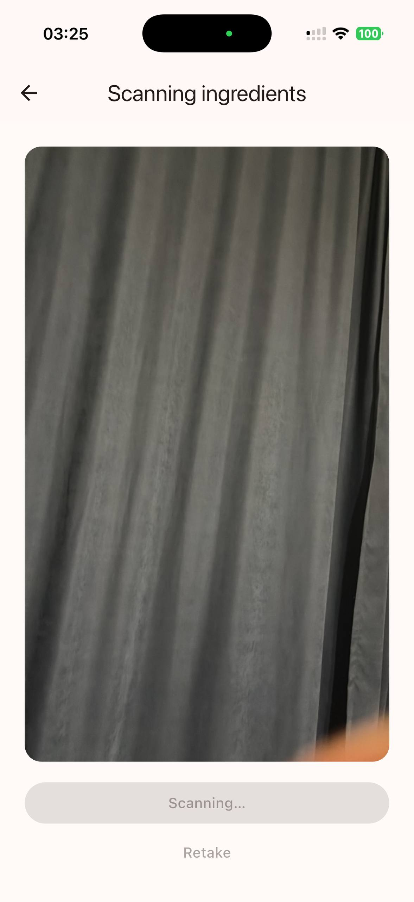
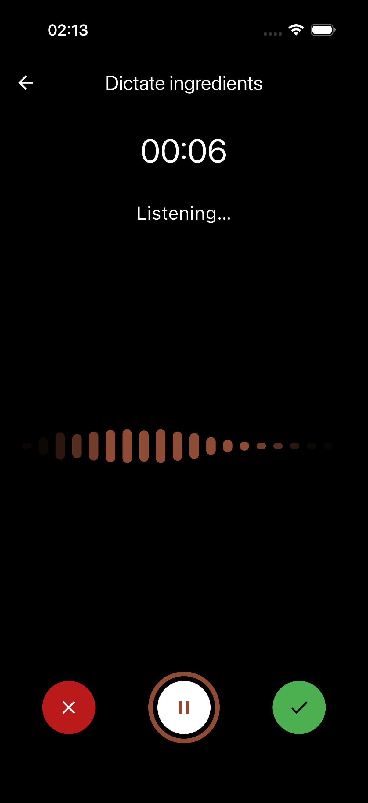
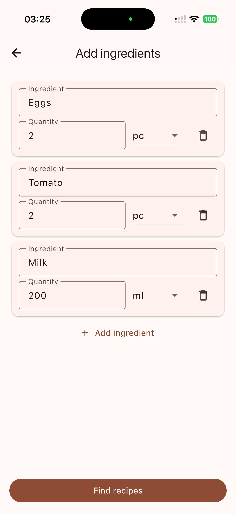
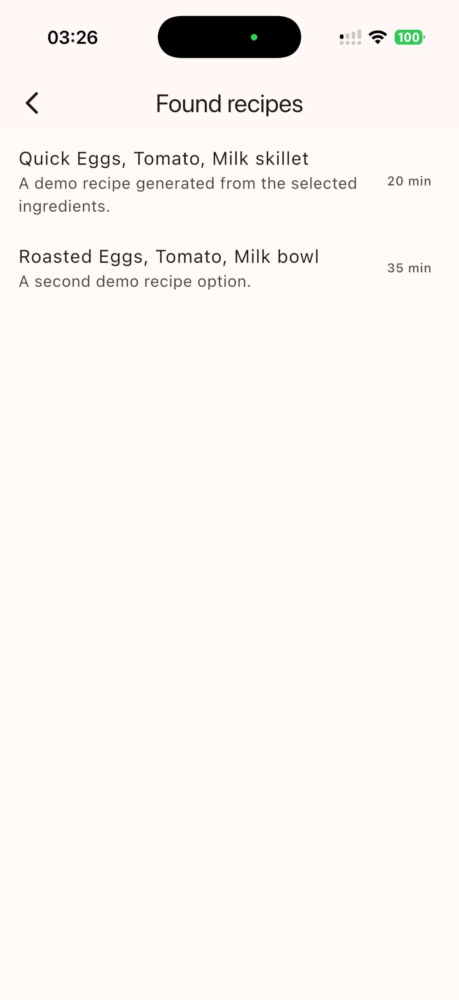

# Recipe Input Showcase

A standalone Flutter portfolio project demonstrating a production-style recipe-input flow: capture or dictate ingredients, review the result, then search for recipe ideas.

## Highlights

- Camera capture and gallery selection, including torch and zoom controls.
- Native audio recording with a live waveform, pause/resume and permission handling.
- Editable ingredient review with quantities, units and validation.
- Recoverable typed `go_router` navigation across camera, audio and manual flows.
- Recipe search results driven by deterministic local demo data—no backend or API keys required.

## Product flow



## Screenshots

<p align="center">
  
  
  
</p>

<p align="center">
  
  
  
</p>

## Demo boundaries

Camera and microphone interactions use native device APIs and require a physical iOS or Android device. Ingredient recognition and recipe search deliberately use local, deterministic demo data: this project demonstrates the UX, state management and integration boundaries, rather than claiming live AI recognition.

## Run

```bash
flutter pub get
dart run build_runner build
flutter run
```
